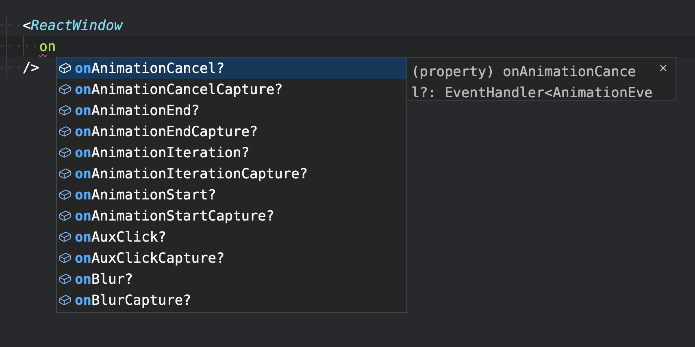

# ReactWindow

[](https://www.npmjs.com/package/@stanko/react-window)
[](https://www.npmjs.com/package/@stanko/react-window)

React components that simplify the management of window and body event listeners.

Instead of manually adding (and removing) listeners using `useEffect`, ReactWindow allows you to attach them in a more intuitive way:

```js
// for window listeners
<ReactWindow
  onClick={() => {
    console.log("Hello world!");
  }}
/>
```

### Demo and Changelog

- [Demo](https://muffinman.io/react-window/)
- [Changelog](CHANGELOG.md)

The library is inspired by [svelte](https://svelte.dev/docs#template-syntax-svelte-window) and is available with the following features:

- Simplifies management of window (and body) event listeners.
- Attaches a single event per listener type (if you have multiple instances of `ReactWindow` with `onClick` in your app, only a single `click` event will be attached).
- Supports conditional rendering.
- Supports `capture` and `passive` [listener options](https://developer.mozilla.org/en-US/docs/Web/API/EventTarget/addEventListener#options).
- Tiny - around 0.5 kB minified and gzipped.
- Fully typed.

## Usage

Get it from npm:

```
$ npm install --save @stanko/react-window
```

Import and use it in your React app:

### ReactWindow base example

```js
import ReactWindow from "@stanko/react-window";

function Example() {
  return (
    <ReactWindow
      onClick={() => {
        console.log("Hello world!");
      }}
      onScroll={() => {
        console.log(`Wheeeeee! ${window.scrollY}px`);
      }}
    />
  );
}
```

### ReactBody base example

`ReactBody` works same as `ReactWindow` but attaches listeners to `document.body` instead of `window`.

```js
import { ReactBody } from "@stanko/react-window";

function Example() {
  return (
    <ReactBody
      onClick={() => {
        console.log("Hello!");
      }}
    />
  );
}
```

### Conditional rendering

```js
import { useState } from "react";
import ReactWindow from "@stanko/react-window";

function Example() {
  const [listenForScroll, setListenForScroll] = useState(true);

  return (
    <div>
      <button
        onClick={() => {
          setListenForScroll(!listenForScroll);
        }}
      >
        {listenForScroll ? "Disable" : "Enable"} scroll listener
      </button>

      {listenForScroll && (
        <ReactWindow
          onScrollPassive={() => {
            console.log(`Wheeeeee! ${window.scrollY}px`);
          }}
        />
      )}
    </div>
  );
}
```

## Listener options

React Window supports `capture` and `options` listener options. These options can be set using the `[onEventName]Capture` and `[onEventName]Passive` variations. 

For example, to set `capture` option for `onClick`, you would use `onClickCapture`.

And to set `passive` option for `onScroll`, you would use `onScrollPassive`.

## Gotchas

There are a couple of gotchas to keep in mind when working with React Window:

### Events are only added on mount

Events are only added on mount and removed on unmount. This means that if you change your handler dynamically, nothing will happen. 

In other words, avoid the following pattern:

```js
<ReactWindow
  onClick={
    someCondition ? () => {
      console.log("handling the event in one way");
    } : () => {
      console.log("handling the event in a different way");
    }
  }
/>
```

This behavior is intentional, as it improves performance and eliminates the need for unnecessary rerenders.

### Double click

React Window uses `onDblClick` to match the native event name, which differs from the built-in React version that uses `onDoubleClick`.

## Supported events

React Window has full TypeScript support and your IDE should provide you with an autocomplete.



Here's a list of all supported events for reference:

### Misc

| Event    | Capture variant |
| -------- | --------------- |
| onLoad   | onLoadCapture   |
| onSelect | onSelectCapture |
| onError  | onErrorCapture  |

### Scroll / Wheel

| Event    | Capture variant | Passive variant |
| -------- | --------------- | --------------- |
| onScroll | onScrollCapture | onScrollPassive |
| onWheel  | onWheelCapture  | onWheelPassive  |

### Focus / Blur

| Event   | Capture variant |
| ------- | --------------- |
| onFocus | onFocusCapture  |
| onBlur  | onBlurCapture   |

### Keyboard

| Event     | Capture variant  |
| --------- | ---------------- |
| onKeyDown | onKeyDownCapture |
| onKeyUp   | onKeyUpCapture   |

### Mouse

| Event         | Capture variant      |
| ------------- | -------------------- |
| onAuxClick    | onAuxClickCapture    |
| onClick       | onClickCapture       |
| onDblClick    | onDblClickCapture    |
| onContextMenu | onContextMenuCapture |
| onDrag        | onDragCapture        |
| onDragEnd     | onDragEndCapture     |
| onDragEnter   | onDragEnterCapture   |
| onDragExit    | onDragExitCapture    |
| onDragLeave   | onDragLeaveCapture   |
| onDragOver    | onDragOverCapture    |
| onDragStart   | onDragStartCapture   |
| onDrop        | onDropCapture        |
| onMouseDown   | onMouseDownCapture   |
| onMouseMove   | onMouseMoveCapture   |
| onMouseOut    | onMouseOutCapture    |
| onMouseOver   | onMouseOverCapture   |
| onMouseUp     | onMouseUpCapture     |
| onMouseEnter  |                      |
| onMouseLeave  |                      |

### Touch

| Event         | Capture variant      | Passive variant     |
| ------------- | -------------------- | ------------------- |
| onTouchCancel | onTouchCancelCapture |                     |
| onTouchEnd    | onTouchEndCapture    |                     |
| onTouchMove   | onTouchMoveCapture   | onTouchMovePassive  |
| onTouchStart  | onTouchStartCapture  | onTouchStartPassive |

### Pointer

| Event                | Capture variant             |
| -------------------- | --------------------------- |
| onPointerDown        | onPointerDownCapture        |
| onPointerMove        | onPointerMoveCapture        |
| onPointerUp          | onPointerUpCapture          |
| onPointerCancel      | onPointerCancelCapture      |
| onPointerEnter       | onPointerEnterCapture       |
| onPointerLeave       | onPointerLeaveCapture       |
| onPointerOver        | onPointerOverCapture        |
| onPointerOut         | onPointerOutCapture         |
| onGotPointerCapture  | onGotPointerCaptureCapture  |
| onLostPointerCapture | onLostPointerCaptureCapture |

### Animation

| Event                | Capture variant             |
| -------------------- | --------------------------- |
| onAnimationStart     | onAnimationStartCapture     |
| onAnimationEnd       | onAnimationEndCapture       |
| onAnimationIteration | onAnimationIterationCapture |
| onAnimationCancel    | onAnimationCancelCapture    |

### Transition

| Event              | Capture variant           |
| ------------------ | ------------------------- |
| onTransitionStart  | onTransitionStartCapture  |
| onTransitionEnd    | onTransitionEndCapture    |
| onTransitionRun    | onTransitionRunCapture    |
| onTransitionCancel | onTransitionCancelCapture |

## Development

Install dependencies and run `npm start`. It will spin up a development server on http://localhost:8000
